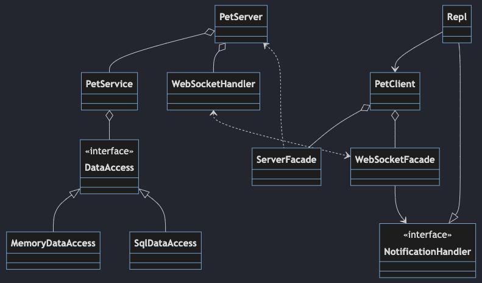

# 🐶 Pet Shop

The Pet Shop application demonstrates many of the topics presented in this course and serves as an example of how the concepts work together as a complete application.

🐈 🦎 🦜 🐠 🐰 🪨 🐢 🐀

**Concepts Demonstrated**

- Console client
- Client HTTP and WebSocket facade
- HTTP and WebSocket Server
- Service
- Data persistence with memory and MySQL implementations
- JSON serialization with type adapter
- Model objects
- Shared code
- Tests at the client, server, service, and data layers

You can use Pet Shop for inspiration on how to build your chess application, but be careful to fully understand what the code is doing before you reuse anything that it provides. Many of the representations are simplified and will not directly translate to what is required in the chess application.

## Source Code

The [Pet Shop source code](.) is found in the course instruction repository that you are currently viewing. If you haven't already cloned the repository to your development environment, then you should do so now. You can then open the IntelliJ Pet Shop project, study, run and debug the code.

## Architecture Diagram

## Class Diagram

